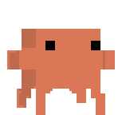
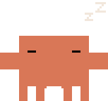
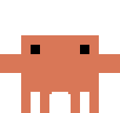
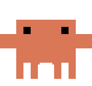
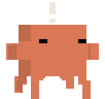

# Sidecrab

**A Claude Code desktop pet** — a tiny always-on-top companion for macOS: a hand-drawn 8-bit pixel crab that floats
over your screen and reacts to what Claude Code is doing — thinking, running commands,
editing, awaiting permission, done. Inspired by the Codex pet in the ChatGPT desktop app
and the crab in [claude-status-bar](https://github.com/m1ckc3s/claude-status-bar).

## What it does

| | | |
|:---:|:---:|:---:|
|  |  |  |
| **idle** — blinks, stretches, waves | **working** — any tool, at his laptop | **thinking** — pondering with a thought bubble |
|  |  |  |
| **needs permission** — flags you down | **wandering** — strolls when you're idle | **sleeping** — after a long quiet spell |
|  |  |  |
| **hovered** — crouches and squints | **done** — happy hop (also when petted) | **harassed** — hover him too much and he chases your cursor |

Interactions: **drag** to reposition (persists) · **click** to pet · **double-click** to
focus the app running the session (Claude Desktop or your terminal) · **right-click**
for the menu (size S/M/L, wander toggle, hook management, quit).

**Wander when idle** (off by default, right-click to enable): when *you* go idle for
~60s, the crab takes little walks around the screen and scurries home when you're back.

## Requirements

Claude Code (CLI, desktop app, or IDE). Nothing else — no node, no python, no other
tools. The activity feed comes from a small bundled binary (`sidecrab-hook`).

## ⚠️ Disclaimer: this app edits `~/.claude/settings.json`

To see Claude Code activity, Sidecrab registers hook entries in
`~/.claude/settings.json` that invoke its bundled `sidecrab-hook` binary. Know this:

- **Nothing is written without your consent.** On first run you get a dialog; declining
  leaves your settings untouched (the crab just idles).
- **Your original file is backed up** to `~/.claude/settings.json.bak` before the first
  edit, and the backup is never overwritten afterwards.
- **Edits are additive.** All existing hooks (other tools included) are preserved; ours
  are appended alongside and are identifiable by the `sidecrab-hook` path.
- **Removal is one click:** right-click the crab → *Remove Claude Code hooks* strips
  exactly our entries and nothing else.

The hook writes state to `~/Library/Application Support/sidecrab/` and does nothing
else: no network, no telemetry, no reading your code.

## Build & run

```bash
# prerequisites: rust toolchain + npm
npm install
npm run tauri dev     # dev
npm run dist          # sidecar + .app + .dmg (+ signed updater artifacts)
```

## Releasing

1. Bump `version` in `src-tauri/tauri.conf.json` (and `package.json`).
2. Commit, tag `vX.Y.Z`, push the tag.
3. The `release` GitHub Action builds a universal macOS app + DMG, signs the
   updater artifacts, and publishes a draft release including `latest.json`.
4. Publish the draft — the in-app **Check for Updates…** (right-click menu)
   finds it via `releases/latest/download/latest.json`, downloads, installs
   over the old app, and relaunches.

Setup once: add repo secrets `TAURI_SIGNING_PRIVATE_KEY` (contents of
`~/.tauri/sidecrab.key`) and `TAURI_SIGNING_PRIVATE_KEY_PASSWORD` (empty).
Losing that key breaks updates for existing installs — back it up.

Gatekeeper: without Apple notarization, downloaded builds show macOS's
"unverified app" flow (System Settings → Privacy & Security → Open Anyway).
For frictionless installs add the `APPLE_*` secrets (Developer ID, $99/yr) —
the workflow picks them up automatically.

Dev niceties:
- `SIDECRAB_IDLE_SECS=10` lowers the wander idle threshold for testing.
- `SIDECRAB_HOME=/tmp/x` redirects the state dir (used by tests).
- Opening `src/index.html` from a plain static server runs the renderer with a
  keyboard state cycler (keys 1–6) for animation work.

Tests: `cd src-tauri && cargo test` (hook event mapping, settings.json installer,
config persistence).

## Trademark & IP disclaimer

This is an unofficial, open-source side project. It is not affiliated with,
endorsed by, or sponsored by Anthropic. "Claude", "Clawd", and the Clawd crab
design are Anthropic's trademarks and intellectual property, referenced here
nominatively. The walk-cycle sprite frames derive from Anthropic's Clawd
artwork (by way of
[claude-status-bar](https://github.com/m1ckc3s/claude-status-bar)'s extraction).

This project is MIT licensed, but that covers the **source code only** and
conveys no rights to Anthropic's trademarks, brand, or artwork (see the scope
note in [LICENSE](LICENSE)). Original replacement art is maintained on the
`feat/original-art` branch.

If this project violates or impedes your trademark or copyright, open an issue
and it will be addressed promptly. This is a free side project; it is not
monetized.
