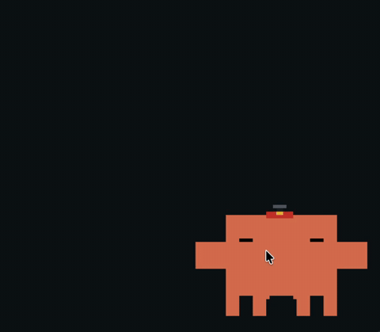
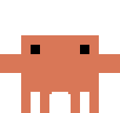
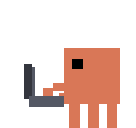
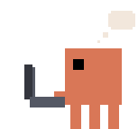
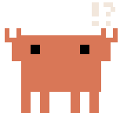
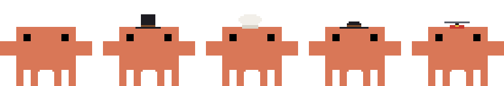

<div align="center">

# 🦀 Sidecrab

**A desktop pet for Claude Code.**

A tiny always-on-top pixel crab that lives on your screen and reacts to what
Claude is doing. He sits at his laptop while Claude works, waves you down when a
tool needs permission, wanders off when you step away, and naps when things go
quiet.

Inspired by the Codex pet in the ChatGPT desktop app and
[claude-status-bar](https://github.com/m1ckc3s/claude-status-bar).



```bash
brew install zvoque/tap/sidecrab
sidecrab
```

</div>

## What he does

| | | | |
|:---:|:---:|:---:|:---:|
|  |  |  |  |
| **idle** | **working** | **thinking** | **permission** |
| resting on your desktop | at his laptop, on any tool | pondering something | flagging you down |

...and a handful of other moods and moves he'll show you himself.

## Interactions

| Do this | He does |
|---|---|
| **Drag** him anywhere | settles there and stays put |
| **Double-click** | focuses the app running your session |
| **Right-click** | opens settings |

**Wander when idle** (off by default): after you've been away ~30 seconds he
takes little strolls around the screen, then scurries home when you're back.

## Hats



Right-click into **Hat** for a top hat, chef's hat, fedora, or helicopter hat.
Whatever he's wearing rides along through every animation.

## Requirements

Just Claude Code. No node, no python, nothing else. The activity feed comes from
a small bundled binary that runs off Claude Code's hooks, so any surface that
fires the hooks in your `~/.claude/settings.json` (the CLI does) drives the crab.

## Setup

On first launch he asks before adding a few hooks to `~/.claude/settings.json`
so he can tell when Claude is working. Your file is backed up first, and you can
remove them anytime from his right-click menu.

Everything else lives in that menu: size, position, hats, wander, and **Launch
at login**. Update with `brew upgrade sidecrab`.

## Trademark & IP

This is an unofficial, open-source side project, not affiliated with, endorsed
by, or sponsored by Anthropic. "Claude", "Clawd", and the Clawd crab design are
Anthropic's trademarks and intellectual property, referenced here nominatively.
The sprite frames derive from Anthropic's Clawd artwork, by way of
[claude-status-bar](https://github.com/m1ckc3s/claude-status-bar).

The MIT license covers the **source code only** and conveys no rights to
Anthropic's trademarks, brand, or artwork (see the scope note in
[LICENSE](LICENSE)).

Violating or impeding your trademark or copyright? Open an issue or reach me on X
([@zvoque](https://x.com/zvoque)) and it'll be sorted promptly. Free side
project, not monetized.
